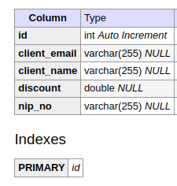
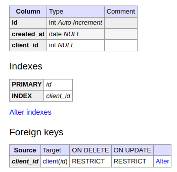
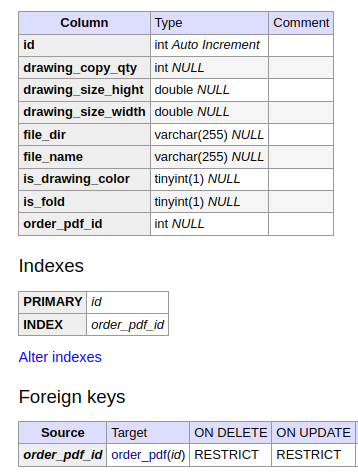

# Project Title: OrderAppRestApi

## Project Description:
OrderAppRestApi is a CRUD application designed to manage customer orders for a large-format CAD printing company. The application allows the user to manage customers, their orders, and a list of PDF files containing CAD architectural drawings. Customers (Client) are stored in the database, and multiple orders (OrderPdf) can be associated with each customer. Likewise, each order can have multiple PDF files (OrderFile) associated with it. Orders are linked to a specific customer by their respective IDs, and PDF files are linked to their corresponding orders by their order IDs.

## Technologies Used:

* Java JDK v.17.0
* Spring Boot v.2.7.5
* Spring Data JPA
* Spring Web
* Maven
* MySQL (production database)
* H2 (in-memory database for testing)
* Flyway
* Lombok
* Bean Validation
* JUnit5
* AssertJ
* Mockito
* MockMVC
* Docker
* Adminer

## Installation:
The application can be run as a Docker container. To do this, first, build the JAR file using the Maven command 

    $mvn clean package 
from the main application directory. According to the configuration in the pom.xml file, a JAR file named orderap-1.jar will be generated. The next step is to build the Docker image using the pre-configured Dockerfile located in the main project directory. Ensure that both the orderap-1.jar file and Dockerfile are in the same directory, then execute the command

    $docker build -f Dockerfile -t orderap-img . 
This command will generate a Docker image named orderap-img and save it in the local Docker registry. The docker-compose.yml file in the main directory allows you to run the application container along with additional containers for the MySQL database and Adminer to view the database. To start all the containers, use the following command: $docker-compose up.

## Usage:
After logging into Adminer, you can view the current state of the database. Adminer is accessible at port 9090, and you can log in using the following credentials:

* System: MySQL
* Server: mysql
* Username: user
* Password: admin
* Database: OrderPdf

## Project folder structure:
        
            ├── src
    │   ├── main
    │   │   ├── java
    │   │   │   └── meRybaczek
    │   │   │       └── orderApp
    │   │   │           ├── dto
    │   │   │           ├── exception
    │   │   │           ├── model
    │   │   │           │   ├── Client.java
    │   │   │           │   ├── OrderFile.java
    │   │   │           │   └── OrderPdf.java
    │   │   │           ├── OrderapApplication.java
    │   │   │           ├── OrderAppConfiguration.java
    │   │   │           ├── repository
    │   │   │           │   ├── ClientRepository.java
    │   │   │           │   ├── OrderFileRepository.java
    │   │   │           │   └── OrderRepository.java
    │   │   │           ├── resource
    │   │   │           │   ├── ClientResource.java
    │   │   │           │   ├── OrderFileResource.java
    │   │   │           │   └── OrderResource.java
    │   │   │           ├── service
    │   │   │           │   ├── ClientService.java
    │   │   │           │   ├── OrderFileService.java
    │   │   │           │   └── OrderService.java
    │   │   │           └── specification
    │   │   └── resources
    │   │       ├── application.properties
    │   │       └── db
    │   │           └── migration
    │   │               └── V1__create_table.sql
    │   └── test
    │       ├── java
    │       │   └── meRybaczek
    │       │       └── orderApp
    │       │           ├── ClientControllerIT.java
    │       │           ├── OrderAppApplicationE2ETest.java
    │       │           ├── OrderFileControllerIT.java
    │       │           ├── OrderPdfControllerIT.java
    │       │           └── service
    │       │               ├── ClientServiceTest.java
    │       │               ├── OrderFileServiceTest.java
    │       │               └── OrderServiceTest.java
    │       └── resources
    │           ├── application.properties
    │           └── db
    │               └── migration
    │                   ├── V1__create_table.sql
    │                   └── V2__insert_test_data.sql
``

## Database Structure:
The Flyway tool is responsible for creating the tables. The migration script V1__create_table.sql creates the following table structures:

#### Client Table:

#### OrderPdf Table:

#### OrderFile Table:

## API Documentation
The API of the application is available on port 8090.

### GET Requests:
####  Retrieve all clients: GET http://localhost:8090/client

Response:

    [
        {
        "id": 1,
        "clientName": "John Doe",
        "nipNo": "1234567890",
        "clientEmail": "john.doe@example.com",
        "discount": 10.0,
        "orderPdfList": []
         }
    ]

####  Retrieve a client by id: GET http://localhost:8090/client/{id}

  * Parameters:

    {id} - id number assigned to the client

Example: GET http://localhost:8090/client/1

Response:

    {
        "id": 1,
        "clientName": "John Doe",
        "nipNo": "1234567890",
        "clientEmail": "john.doe@example.com",
        "discount": 10.0,
        "orderPdfList": []
    }

####  Parameterized GET requests: GET http://localhost:8090/client?clientName={clientName}&clientEmail={clientEmail}&discount={discount}

  * Parameters:

      {clientName} - clients with the given name

      {clientEmail} - clients with the given email

      {discount} - clients with the given discount

Example: GET http://localhost:8090/client?clientName=John

Response:

    [
        {
            "id": 4,
            "clientName": "John",
            "nipNo": "1234567890",
            "discount": 10.0
        }
    ]

####  Retrieve all orders: GET http://localhost:8090/order

Response:

    [
        {
        "id": 2,
        "createdAt": "2023-07-25",
        "client": {
            "id": 2,
            "clientName": "John Doe",
            "nipNo": "1234567890",
            "discount": 10.0
        }
    },
    {
        "id": 3,
        "createdAt": "2023-07-25",
        "client": {
            "id": 2,
            "clientName": "John Doe",
            "nipNo": "1234567890",
            "discount": 10.0
        }
    }
    ]

####  Retrieve an order by ID: GET http://localhost:8090/order/{id}
  * Parameters:

    {id} - order given id

Example: GET http://localhost:8090/order/1

Response:

    {
        "id": 1,
        "createdAt": "2023-07-25",
        "client": {
        "id": 1,
        "clientName": "John Doe",
        "nipNo": "1234567890",
        "discount": 10.0
        }
    }

####  Parameterized GET requests for orders: GET http://localhost:8090/order?clientId={clientId}&clientName={clientName}&createdAt={createdAt}

* Parameters:

    {clientId} - ID of the client

    {clientName} - name of the client

    {createdAt} - order creation date

The above parameters can also be provided separately in the request:

Example: GET http://localhost:8090/order?clientName=John%Doe

Response:

    [
        {
            "id": 1,
            "createdAt": "2023-07-25",
            "client": {
            "id": 2,
            "clientName": "John Doe",
            "nipNo": "1234567890",
            "discount": 10.0
            }
        }
    ]

####  Retrieve a list of files (OrderFile) for a specific order (OrderPdf) by order ID: GET http://localhost:8090/orderFile?orderId={orderId}

* Parameters:

    {orderId} - ID of the order

Example: GET http://localhost:8090/orderFile?orderId=2

Response:

    [
    {
        "id": 9,
        "fileName": "file9.pdf",
        "fileDir": "/path/to/file1.pdf",
        "orderPdf": {
            "id": 2,
            "createdAt": "2023-07-25",
            "client": {
                "id": 2,
                "clientName": "John Doe",
                "nipNo": "1234567890",
                "discount": 10.0
            }
        }
    }
    ]

####  Retrieve a file by ID: GET http://localhost:8090/orderFile/{id}

Example: GET http://localhost:8090/orderFile/1

Response:

    {
    "id": 1,
    "fileName": "file9.pdf",
    "fileDir": "/path/to/file1.pdf",
    "drawingSizeWidth": 297.0,
    "drawingSizeHight": 594.0,
    "drawingCopyQty": 1,
    "drawingColor": false,
    "fold": false
    }

### POST and PUT request:

#### Saving a client (Client) to the database: POST http://localhost:8090/client

POST and PUT requests require providing the appropriate JSON body, for example:

    {
    "clientName": "BigLebowski",
    "nipNo": "1234567890",
    "clientEmail": "john.doe@example.com",
    "discount": 10
    }

Response:

    {
    "id": 5,
    "clientName": "BigLebowski",
    "nipNo": "1234567890",
    "discount": 10.0
    }

The above request saved the client to the database, assigning it an id of 5.

#### Saving an order (OrderPdf) to the database:
To save an order, you need to provide the client's id as a parameter and the order body.
The order is required to be associated with a client.
POST http://localhost:8090/order?clientId={clientId}

* Parameters:

  {clientId} - ID of the client

For example:

POST http://localhost:8090/order?clientId=2

JSON body:

    {
    "createdAt": "2023-07-25"
    }

Response:

    {
    "id": 4,
    "createdAt": "2023-07-25",
    "client": {
        "id": 2,
        "clientName": "John Doe",
        "nipNo": "1234567890",
        "discount": 10.0
    }
    }

The above request saved the order for the client with id 2 and assigned the order an id of 4.

#### Saving a list of files (OrderFile) to the database:
To save a list of files, you need to provide the order's id as a parameter and the body with the list of files.
Files are required to belong to a specific order.

POST http://localhost:8090/orderFile?clientId={orderId}

* Parameters:

    {orderId} - the id of the order to which you want to add the list of files.

For example:

POST http://localhost:8090/orderFile?orderId=1

JSON body:

    {
    "fileName": "file9.pdf",
    "fileDir": "/path/to/file1.pdf",
    "drawingSizeWidth": 297.0,
    "drawingSizeHight": 594.0,
    "drawingCopyQty": 1,
    "drawingColor": false,
    "fold": false
    }

Response:

    {
    "id": 9,
    "fileName": "file9.pdf",
    "fileDir": "/path/to/file1.pdf",
    "orderPdf": {
        "id": 1,
        "createdAt": "2023-07-25",
        "client": {
            "id": 1,
            "clientName": "John Doe",
            "nipNo": "1234567890",
            "discount": 10.0
        }
    }
    }

The above request adds the file provided in the body to the order with id 1 and assigns the file an id of 9.

### DELETE requests:

#### Deleting a client (Client):
DELETE http://localhost:8090/client?id={id}

* Parameters:
* 
    {id} - client's id

Example:

DELETE http://localhost:8090/client?id=2

The above DELETE request will delete the client with id=2.

#### Deleting an order (OrderPdf):
DELETE http://localhost:8090/order?id={id}

* Parameters:
    {id} - order's id

Example:

DELETE http://localhost:8090/order?id=4

The above DELETE request will delete the order with id=4.

#### Deleting a file (OrderFile):

DELETE http://localhost:8090/orderFile?id={id}

* Parameters:
    {id} - file's id

Example:

DELETE http://localhost:8090/orderFile?id=4

The above DELETE request will delete the file (OrderFile) with id=4.

### Form fields validation:

Body fileds must meet below conditions: 

    'clientName' - not null field;
    'nipNo'- not null field, 10-digit number;
    'clientEmail' - email structure form;
    'discount' - number between 0 and 100;
    'createdAt' - present or future date;
    'fileName' - not null field;
    'fileDir' - not null field;
    'drawingSizeWidth' - positive number;
    'drawingSizeHight' - positive number;